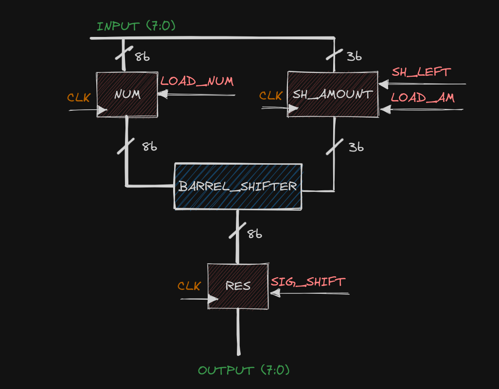
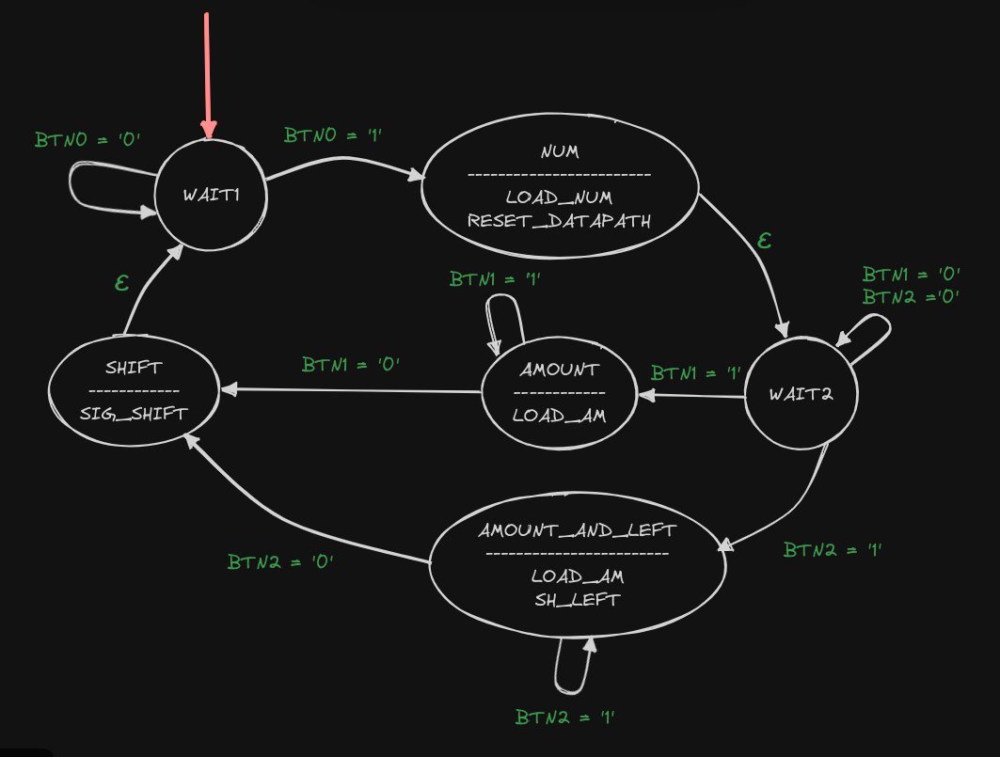
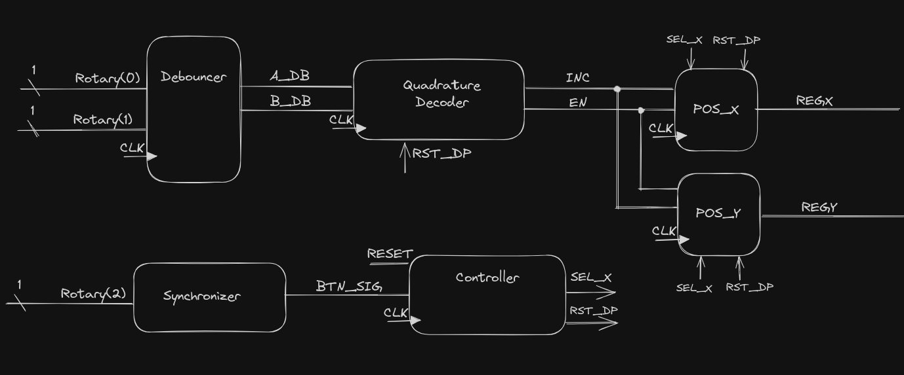
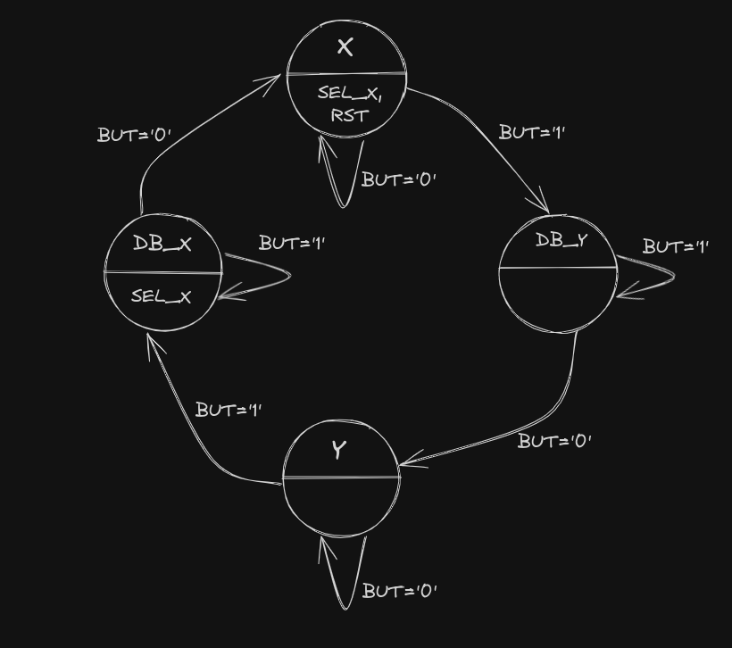
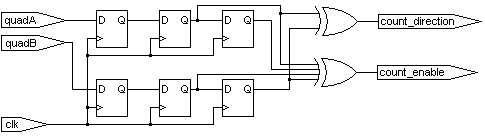

= Projekt 1: Úloha 1 - Cyklický posouvač vlevo a vpravo II.

=== Implementační platforma

Přípravek Digilent Basys 3.

=== Popis chování

V klidovém stavu obvod čeká na zadání 8-bitového operandu A pomocí přepínačů SWITCH(7:0). Operand je načten při stisku tlačítka BTN0. Následně obvod očekává délku posunu L (3-bitové číslo bez znaménka) zadanou na SWITCH(2:0). Při stisku BTN1 je hodnota SWITCH(2:0) chápána jako délka posuvu vpravo, při stisku BTN2 je chápána jako délka posuvu vlevo. Následně je proveden příslušný posun a výsledek C je zobrazen na sedmisegmetovém displeji. Při stisku (a podržení) tlačítka BTN3 se na tomtéž sedmisegmentovém displeji zobrazí operand A a délka posuvu L. Směr posuvu je indikován diodou LD0.

=== Blokové schéma datové cesty

=== Graf přechodů a výstupů řadiče

=== Archiv se soubory

link:./hw01_cyc_shift_galrene.zip[Projekt1.1-Cyklicky_posuv.zip]

=== Popis souborů

[options="autowidth"]
|====
^h|  Soubor                                                                ^h|  Popis
| link:./cyc_shift_2/datapath.vhd[datapath.vhd]                          | datová cesta
| link:./cyc_shift_2/controller.vhd[controller.vhd]                      | řídící jednotka
| link:./cyc_shift_2/cyc_shift.vhd[cyc_shift.vhd]        | top-level entita (pro verifikaci)
| link:./cyc_shift_2/tb_cyc_shift.vhd[tb_cyc_shift.vhd]            | testbench - stimuly a kontrolní výsledky jsou v externích souborech
| link:./cyc_shift_2/gen_input.txt[gen_input.txt], link:./cyc_shift_2/gen_exp_output.txt[gen_exp_output.txt]         | soubory se stimuly a správnými výsledky pro testbench výše
| link:./cyc_shift_2/hex2seg.vhd[hex2seg.vhd]                            | převodník na sedmisegmentovky
| link:./cyc_shift_2/shift_and_io.vhd[shift_and_io.vhd]        | top-level entita + displej (pro validaci - nahrání do přípravku)
| link:./cyc_shift_2/constrs.xdc[constrs.xdc]                     | přiřazení pinů
| link:./cyc_shift_2/tb_gen.py[tb_gen.py]               | generátor vstupů a výstupů (pro testbench)
|====

= Projekt 2: VGA a rotary switch

== Rozdelenie rolí

[options="autowidth"]
|====
| 1. tím | Rotary Switch design | VGA testbench | René Gál
| 2. tím | VGA design | Rotary Switch testbench | Matěj Melichna
|====

== Implementačná platforma

Prípravok Digilent Basys 3

== Popis chování

Otáčaním rotary switchu doprava sa inkrementuje hodnota registru, doľava sa dekrementuje.
Stlačením switchu sa prepína na ovládanie druhého registru.
VGA časť predpokladá, že prvý register určuje horizontálnu súradnicu a druhý vertikálnu súradnicu miesta,
kde má vykreslovať stred kríža. Dohodou bolo, že sa bude vykreslovať iba na 255x255 pixelov obrazovky.

**
Úspešne odovzdaná a obodovaná časť bola iba VGA testbench. V rozrobenej implementácii rotary decoderu je potrebné
odstrániť quadrature decoder a nahradiť ho automatom, ktorý rozhoduje o smere rotácie.
**

== Datapath

== Controller  diagram

== Quadrature decoder - nesprávne

=== Popis souborů

[options="autowidth"]
|====
^h|  Soubor                                                                ^h|  Popis
| link:./rotary_dec/rotary_dec.srcs/sources_1/new/datapath.vhd[datapath.vhd]                          | datová cesta
| link:./rotary_dec/rotary_dec.srcs/sources_1/new/controller.vhd[controller.vhd]                      | řídící jednotka
| link:./rotary_dec/rotary_dec.srcs/sources_1/new/Debouncer.vhd[debouncer.vhd]                  | debouncer
| link:./rotary_dec/rotary_dec.srcs/sources_1/new/rotary_dec.vhd[rotary_dec.vhd]        | top-level entita (pro verifikaci)
| link:./rotary_dec/rotary_dec.srcs/sources_1/new/quadrature_dec.vhd.vhd[quadrature_dec.vhd]        | kvadraturny dekoder - nespravne, treba implementovat automatom
| link:./rotary_dec/rotary_dec.srcs/sources_1/new/synchronizer.vhd[synchronizer.vhd] | dva D klopne obvody pre synchronizaciu vonkajsich vstupov na hodinovy signal
| link:./rotary_sw_vga/rotary_sw_vga.srcs/sources_1/imports/rotary_switch_vga/vga_sw_model.vhd[vga_sw_model.vhd] | softvérový model VGA
| link:./rotary_sw_vga/rotary_sw_vga.srcs/sim_1/imports/rotary_switch_vga/tb_vga.vhd[tb_vga.vhd] | testbench pre VGA
|====
